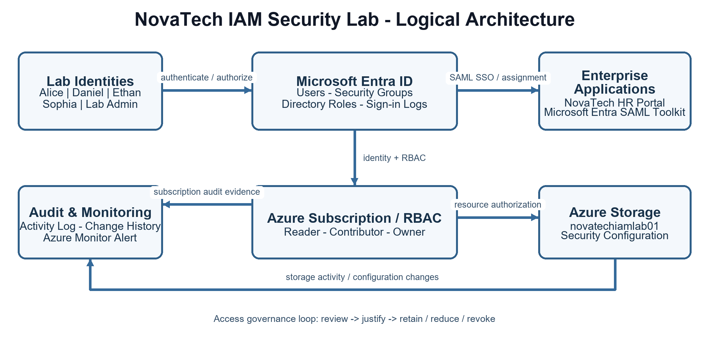

# NovaTech Identity & Access Management Security Lab

Hands-on Microsoft Entra ID and Azure IAM security lab for a fictional organisation, NovaTech.

## Project summary

This project demonstrates practical identity lifecycle management, least-privilege access control, SAML single sign-on, Azure RBAC, audit investigation, monitoring, offboarding, and manual access governance.

The lab was built and tested in Microsoft Entra ID and Microsoft Azure using five lab identities, role-oriented security groups, enterprise applications, Azure Storage, subscription-level RBAC, Activity Log, change history, and Azure Monitor alerting.

## Security capabilities demonstrated

- Entra users, groups, and directory roles
- Least-privilege role design using Helpdesk Administrator and Security Reader
- Azure RBAC testing with Reader and temporary Contributor access
- Microsoft Entra SAML Toolkit and NovaTech HR Portal assignment
- SAML troubleshooting involving ACS/Reply URL and NameID configuration
- Azure Activity Log and change-history investigation
- Administrative-operation monitoring and email alerting
- Leaver offboarding with account disablement and entitlement removal
- Manual access review when native Access Reviews were unavailable in the tenant

## Architecture

The architecture separates identity, enterprise applications, Azure authorization, storage, and audit/monitoring. Identity flows from lab users through Microsoft Entra ID to enterprise applications; Entra authorization flows to Azure subscription/RBAC and Azure Storage; subscription and storage activity feed Audit & Monitoring.

## Repository contents

| Path | Purpose |
|---|---|
| `docs/project-summary.md` | Recruiter-friendly project summary and outcomes |
| `docs/limitations-and-lessons.md` | Confirmed limitations, troubleshooting, and lessons learned |
| `diagrams/architecture.png` | Corrected Figure 1 architecture diagram |
| `reports/NovaTech_IAM_Security_Lab_Final_Report.pdf` | Complete final portfolio report |

## Evidence and privacy

The final report uses sanitized, public-release-safe evidence. Tenant, subscription, request, IP, certificate, and personal account details should remain redacted before publication. Screenshots can be added under `evidence/` after a final privacy review.

The PDF in `reports/` is the canonical public report. A fixed-layout DOCX copy is retained locally where needed.

## Limitations

Native Entra Identity Governance Access Reviews and automated lifecycle workflows were not available in the lab tenant. Access governance was therefore completed manually and documented as a limitation and future enhancement. Conditional Access and PowerShell/Graph inventory automation are not claimed as completed controls.

## Author

Harsh Chaudhary  
Cybersecurity portfolio project | Microsoft Entra ID | Azure IAM

